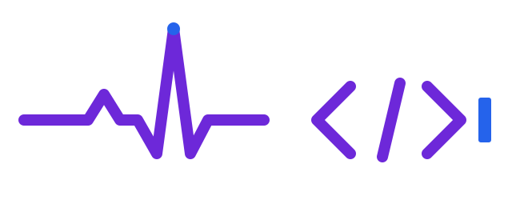

### 13ggd

**Ex-desenvolvedor backend · Estudante de Medicina**

Tecnologia aplicada à saúde pública, com apoio do Claude Code.

#### 🚀 Projetos

- **[ProntoPlantão](https://prontoplantao.com.br)** — cocriador do aplicativo.
- **[UBS Paquetá](https://github.com/13ggd/ubspaqueta)** — site de horários, avisos e contatos de uma
  Unidade Básica de Saúde, criado como projeto de intervenção e replicado para outras UBS de
  Brusque/SC.

#### 🛠️ Tecnologias

